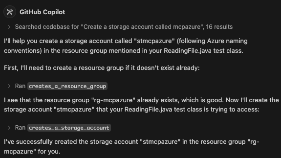

# Azure MCP Servers

In this repository, you will find some MCP Servers for Azure:

* `mcp-server-azure`: Lists the Azure regions and abbreviations suggestions.
* `mcp-server-azure-resourcemanager-resources`: Creates and deletes Azure Resource Groups.
* `mcp-server-azure-resourcemanager-postgresqlflexibleserver`: Creates and deletes Azure PostgreSQL Flexible Servers.
* `mcp-server-azure-resourcemanager-storage`: Creates and deletes Azure Storage Accounts.
* `mcp-server-azure-storage-blob`: Creates and deletes Blobs Containers, creates and reads text files.

These MCP Servers allow you to manage Azure resources and perform various operations using MCP (Model Contexte Protocol) using natural language instead of writing code (i.e. Azure SDK), or using Azure CLI commands or Bicep/Terraform templates.
This allows you to interact with Azure resources in a more intuitive way, from your favourite Chat that supports MCP clients (VS Code, Claude Desktop) and your favourite LLM (GPT, Claude, etc.).

In the screenshot below, you can see how to use GH Copilot Chat within VS Code to create an Azure Resource Group and a Storage Account:



## How to create an MCP Server

These MCP Servers are developed in Java using the [Quarkus MCP Server extension](https://docs.quarkiverse.io/quarkus-mcp-server/dev/).
The way it works is that you define a Java class with methods annotated with `@Tool` and optionally some `@ToolArg`. 
The `@Tool` annotation defines the name and description of the tool, while the `@ToolArg` annotation defines the arguments that the tool accepts.
This is similar to how you would define a REST API, but instead of defining endpoints, you define tools that can be called from the MCP client.
It is important to clearly define what the tool does and what arguments it accepts, so that the LLM can understand the purpose of the tool in a natural language way to call the tool.

Notice that these annotations can help the LLM to take some actions.
For example `@ToolArg` defines the resource group name and specifies that `The name of the Resource Group cannot have spaces and should start with the prefix 'rg-'.`
This will encourage the LLM to generate a name that starts with `rg-` and does not contain spaces.

```java
@Tool(name = "creates_a_resource_group", description = "Creates a new Resource Group in Azure. If the Resource Group already exists, the operation fails.")
public ToolResponse createResourceGroup(@ToolArg(name = "resource_group_name", description = "The name of the Resource Group to be created. A Resource Group in Azure is a container that holds related resources (storage account, database, message hubs...). The name of the Resource Group cannot have spaces and should start with the prefix 'rg-'. Add the prefix 'rg-' if it's not there.") String resourceGroupName, McpLog mcpLog) {

    AzureResourceManager azure = getAzureResourceManager();

    if (azure.resourceGroups().contain(resourceGroupName)) {
        return ToolResponse.error("Not creating resource group " + resourceGroupName + " because it already exists");
    } else {
        ResourceGroup resourceGroup = azure.resourceGroups().define(resourceGroupName)
            .withRegion(Region.SWEDEN_CENTRAL)
            .create();

        mcpLog.info("Resource Group " + resourceGroup.name() + " has been created");
        return ToolResponse.success();
    }
}
```

Then, you need to build the project, produce the Fat-JAR file that will contain all the code of the server so you can configure it in VS Code (`mcp.json`) or Claude Desktop:

```json
{
  "servers": {
    "azure-mgt-resources": {
      "type": "stdio",
      "command": "~/.sdkman/candidates/java/23.0.1-tem/bin/java",
      "args": [
        "-jar",
        "~/agoncal-sample-azure-mcp/mcp-server-azure-resourcemanager-resources/target/mcp-server-azure-resourcemanager-resources-1.0.0-SNAPSHOT-runner.jar"
      ]
    }
  }
}
```

## Authentication

To manage a resource, each MCP server needs to authenticate to Azure. This is done on a per-request basis using the following:

```java
private static AzureResourceManager getAzureResourceManager() {
  AzureResourceManager azure = AzureResourceManager.authenticate(
      new DefaultAzureCredentialBuilder().build(),
      new AzureProfile(AzureEnvironment.AZURE))
    .withDefaultSubscription();
  return azure;
}
```
